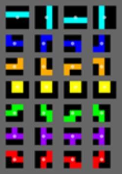

# Tetris

## Description
This is a Tetris game written in C# using the Unity game engine. It is a 2D game that uses a grid to place the blocks. The game is played by moving and rotating the blocks as they fall down the screen. The goal is to fill up rows of the grid to clear them and prevent the blocks from reaching the top of the screen.

## Table of Contents
- [Tetris](#tetris)
  - [Description](#description)
  - [Table of Contents](#table-of-contents)
  - [Overview](#overview)
  - [Features](#features)
  - [How to Play](#how-to-play)

## Overview
The game is made up of 3 main scenes: "Tetris Game", "Tetris Main Page" and "Game Over Screen". The "Tetris Game" scene contains the grid and the blocks, and is where the game is played. The "Tetris Main Page" scene is the main menu of the game, where the player can start a new game or quit the game. The "Game Over Screen" scene is where the player is taken when they lose the game. The player can then choose to play again or return to the main menu.

## Features
- The game uses a dictionary to store the blocks and their rotations.
- SRS rotation system is used to rotate the blocks(https://tetris.wiki/Super_Rotation_System).

    

- The usage of a rotation matrix to rotate the blocks.
- Collision testing to prevent blocks from overlapping or going out of bounds.

    

## How to Play
- Use the Spacebar to do a hard drop
- Use the Arrow Keys to move the blocks

## Credits
- The SRS rotation system was implemented using the information from this website: https://tetris.wiki/Super_Rotation_System
- The rotation matrix was implemented using the information from this website: https://en.wikipedia.org/wiki/Rotation_matrix
- The collision testing was implemented using the information from this website: https://www.youtube.com/watch?v=ODLzYI4d-J8&ab_channel=Zigurous